# DFlash Speculator Ablation — Full Report (Qwen3-8B)

A complete account of the DFlash draft-model ablation for Qwen3-8B: the original architecture sweep
(AdamW), the implementation bugs it surfaced, the dataset fix, the **Muon-optimizer** regime that reset
many conclusions, and the **benchmark-acceptance** validation on real prompts. Exhaustive numeric
leaderboards live in [`RESULTS.md`](../RESULTS.md); durable findings are in the agent memory dir.

Two metrics appear throughout:
- **magpie val-EAL** (`val/eal_epoch`): teacher-forced expected-accepted-length on a held-out slice of
  the magpie training data. `EAL = Σ_k Π_{i≤k} a_i` over drafted block positions. The *training* metric.
- **benchmark τ**: the same accept-length, but on the **RedHatAI/speculator_benchmarks** prompts, scored
  against the **verifier's own greedy continuation** (the real spec-decode target). The *deployment* metric.

---

## 0. TL;DR

- **Validated best recipe — common core:** **Muon (lr 0.01) + forward-KL + causal + FFN 6144**, 5 epochs
  on the full 4997-sample data. Window/depth have two optima: **max-acceptance = window 2048 / depth 7**;
  **deployment-optimal (cost-aware) = window ~1024 / depth ~3–4** (§6).
- **Muon is the single biggest lever:** **+28% magpie-EAL / +33% real-τ over AdamW** at identical
  arch/data — larger than *any* architecture knob.
- **magpie-EAL 1.62 → real benchmark τ ≈ 1.16:** the training metric **overstates real acceptance by
  ~30%** (consistently τ ≈ 0.71–0.74 × EAL).
- **Several earlier conclusions reversed** once bugs were fixed and the optimizer changed:
  "smaller window better" → **wider, peak ~2048**; "depth-2 fine / deeper hurts" → **deeper helps**
  (but cost-capped ~5); "jsd fine-tune is best (1.314)" → that JSD was **numerically broken**; the best
  standalone loss is plain **forward-KL**.
- **EAL alone is misleading for deployment** — it can't price draft cost or the real prompt mix. The
  benchmark + a spec-decode cost model pick **depth ~3–4 and window ~1024**, not the EAL-optimal
  depth 7 / window 2048.


---

## 1. Setup

- **Verifier:** Qwen3-8B (36 layers, hidden 4096, 32/8 heads). Draft fuses the verifier's aux hidden
  states (layers 1·9·17·25·34) and predicts a block of `block_size=8` tokens; acceptance is per block
  position 1..7.
- **Data:** `magpie_5k`. The offline generator originally dropped ~28% (3613/5000); **fixed to 4997**
  (Phase C). Hidden states for the 6-layer superset (1·9·17·25·34·36) are cached so every run reads
  identical inputs.
- **Harness:** `ablation/` — `run.sh` (one run/GPU off the cache), `queue.sh` (fan across 8 GPUs),
  `eal.py` (rank by EAL), and the new acceptance harness (Phase E). All single-GPU per run.

---

## 2. Phase A — original architecture ablation (AdamW)

The first sweep held the optimizer fixed (AdamW) and varied one architecture knob at a time, screening
@2 epochs then promoting winners @5/15 epochs on the 3613-sample cache.


**Findings at the time:** sliding-window attention was the dominant win and *smaller* windows looked
better (64–128 > 256 > full); FFN-6144 beat the inherited 12288; causal ≈ bidirectional (tiny edge to
causal); uniform all-SWA beat any full-attention layer mix; CE ≈ forward-KL ≈ KL+CE standalone.


The headline recipe was *5-layer + SWA-128 + FFN-6144 + causal*, CE then **jsd fine-tune → EAL 1.314**.
**⚠️ Several of these conclusions were later invalidated** (bugs + regime change); see Phases B–E.

---

## 3. Phase B — audit & bug fixes

A 6-reviewer adversarial audit of the prior implementation (13 confirmed findings). The consequential ones:

- **🔴 JSD loss was numerically broken.** `jsd_loss` floored the mixture distribution with `clamp_min(_EPS)`
  where `_EPS=1e-5`, but the ~uniform per-token mass for the 152k vocab is ~6.6e-6 (below the floor) — so
  the clamp corrupted `log m` across the vocabulary and JSD came out **negative** (must lie in [0, ln 2]).
  **→ the "jsd fine-tune is best (1.314)" Phase-A conclusion was trained on a corrupted objective and is
  invalid.** Fixed with `logaddexp` (Phase D re-establishes the loss ranking; see fig 10 — jsd now trains).
- **🟡 weight-decay default regression** (0.01→0.0 in an optimizer refactor) — "baseline reproduces
  byte-for-byte" was false. Restored to 0.01.
- **🟡 swa_layer_pattern** validated only for length, not charset / window-set — silent mis-config risk.
- **🟢 EAL averaging bias** — the logged `val/eal_epoch` averages a *per-batch* EAL (a non-linear
  sum-of-products); the benchmark eval (Phase E) instead accumulates per-position **counts** for an
  unbiased estimate.
- Plus an inductor-scoping/E402 fix and a layer-selection guard.

---

## 4. Phase C — dataset fix (3613 → 4997)

The cache had only 3613/5000 samples; the handoff blamed "incomplete metadata." The real causes:
1. **`DEFAULT_REQUEST_TIMEOUT = 15s`** — far too short for ~4k-token prefills under the dp=8 / concurrency-32
   generation; the slow tail timed out and was skipped. Fixed with `--request-timeout 600`.
2. **A server-write / client-validate race** ("incomplete metadata, file not fully covered") — the server
   returns the hidden-state path before its async write flushes. Fixed with a validate-retry.

Recovered to **4997/5000** (the last 3 are long sequences the server deterministically fails to write).
All Phase-D/E runs use this full dataset.

---

## 5. Phase D — Muon regime (training dynamics)

Switched the optimizer to **Muon** (2-D weight matrices) + AdamW (embeddings/norms), 5 epochs on the full
4997 data. These plots show how the metrics *evolve*, not just final numbers.

**M0 — Muon LR sweep ≫ AdamW.** Every Muon LR converges faster *and* to a higher plateau than AdamW; best
LR ≈ 0.01–0.02 (flat), no divergence to 0.07.

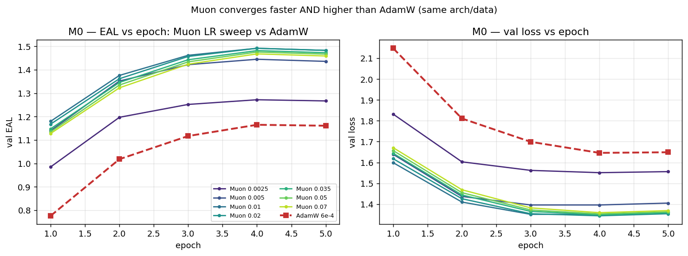

**M1 — losses: all bootstrap; KL wins; two-stage hurts.** With Muon + the JSD fix, every standalone loss
trains from scratch (jsd no longer flat at ~0.05, confirming the Phase-B bug). **Forward-KL edges CE**
(1.516 vs 1.493). The two-stage CE→soft fine-tunes all *dip below* the CE start — the LR-schedule restart
degrades the converged model (the CE-continuation control proves it's the schedule, not the loss) — so
two-stage is dropped.

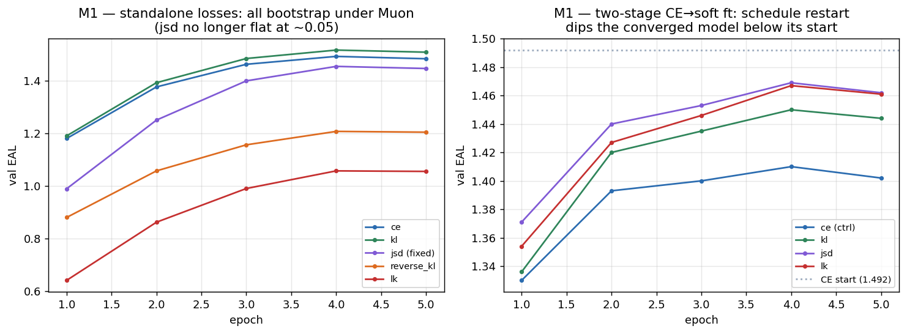

**M2a/b — window: larger is better, broad peak ~1536–2048 (REVERSES the old finding).** The old
"smaller-window-better" was an AdamW / 2-ep / 3613-data artifact. The per-epoch curves separate cleanly at
every epoch (tight 2-seed bands); the size curve is an inverted-U peaking at 2048, declining toward full.

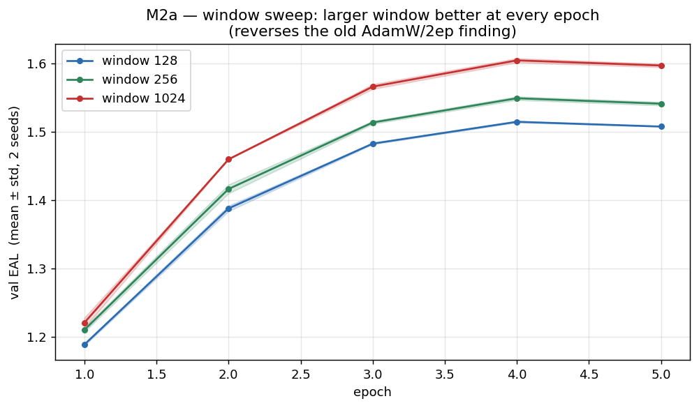
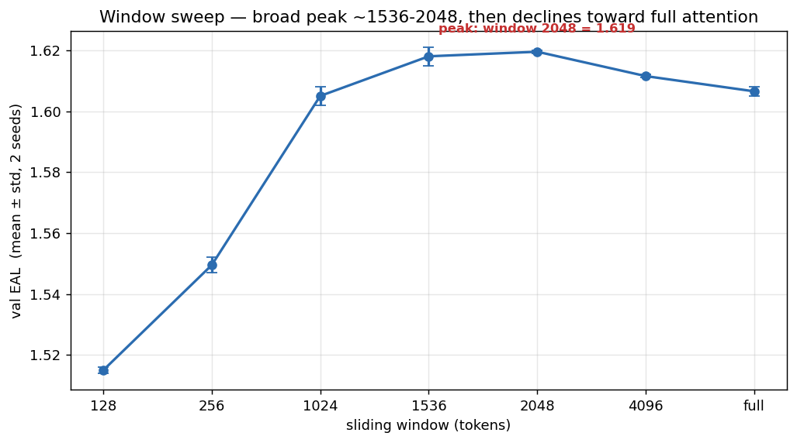

**M2c — depth: deeper is monotonically better, still climbing at 7** (also reverses the old "depth-2
fine / deeper hurts"). Best magpie-EAL: **depth 7 @ w2048 = 1.645**.

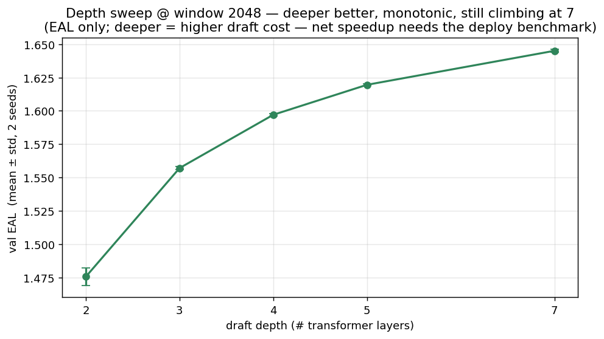
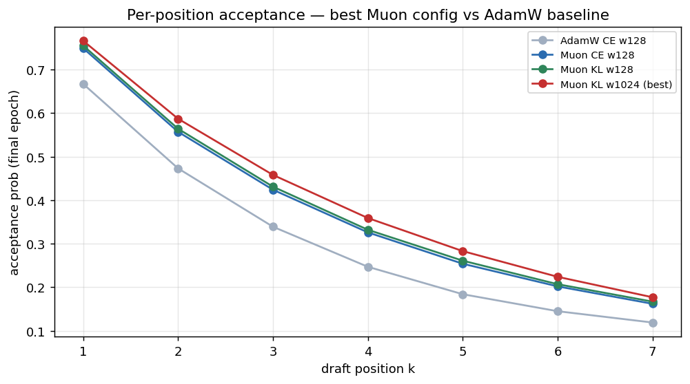

**Magpie progression:** 1.314 (old, buggy-jsd) → 1.4925 (Muon CE) → 1.5164 (KL) → 1.6194 (w2048) →
1.6449 (depth 7) — a trustworthy **+25%** over the old "best," bugs fixed and seeded throughout.

**M3 — SWA/full layer-position mix (repeat of Phase A's layer-mix under the Muon recipe).** With the `s`
layers now at window 1024 (already wide), the per-layer SWA-vs-full *positioning* turns out
**irrelevant**: across the 8 patterns (sssss…fffff) magpie-EAL spans only 1.604–1.614 and benchmark τ only
1.144–1.158 (~1%, within seed noise), and the two metrics even disagree on the order (sfsfs is EAL-#1/τ-#3;
ffsss is EAL-last/τ-#1). This **reverses** the old AdamW/window-128 result (uniform all-SWA clearly best,
full-attention layers hurting monotonically over an 0.086 spread) — the strong local-context prior at
window 128 is moot at 1024. all-full (`fffff`) is marginally worst on both metrics; uniform `sssss` is
statistically tied with the best. Practical: **use uniform window-1024, don't bother mixing.**

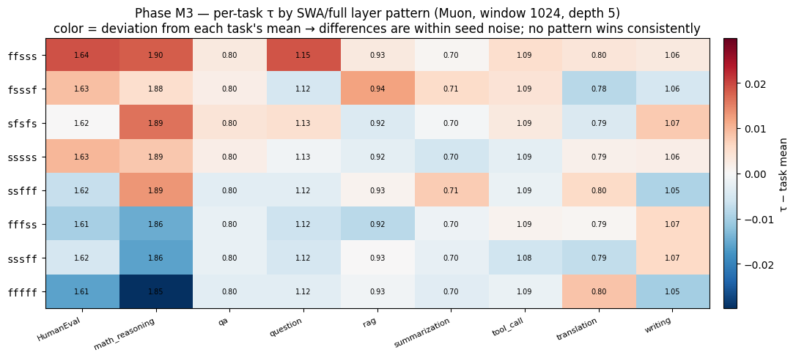

---

## 6. Phase E — benchmark validation (the deployment metric)

The acceptance harness (`build_benchmark_cache.sh` + `eval_acceptance.py`) generates Qwen3-8B's greedy
continuation for **841/924** RedHatAI/speculator_benchmarks prompts, extracts the aux hidden states, and
scores each draft checkpoint's per-position acceptance + accept-length τ per domain (unbiased counts).

**magpie val-EAL overstates real acceptance by ~30%, but the ranking is preserved.** τ ≈ 0.71–0.74 × EAL
across every checkpoint; the order (Muon≫AdamW, KL>CE, wider/deeper better) is identical — so the ablation
conclusions hold on the deployment distribution. Muon's edge is even larger on real prompts: **+33%** τ
over AdamW.

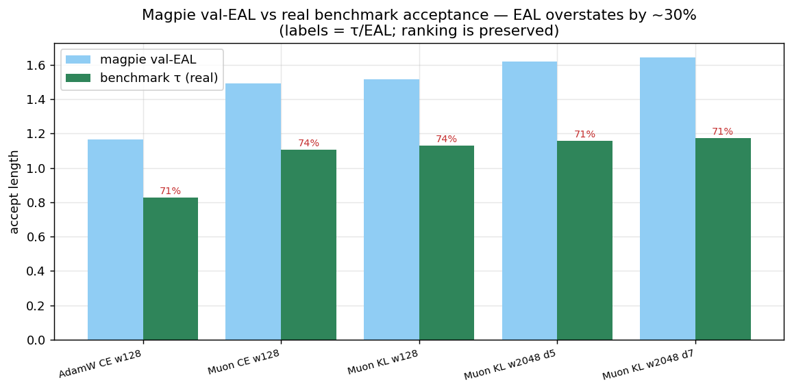

**The architecture gains compress on real prompts — and the depth verdict flips.** The window gain shrinks
(magpie +6.9% → benchmark +2.6%) **and saturates at ~1024** — benchmark τ is 1.157 for window 1024 = 1536
= 2048, then *declines* (4096 → 1.149, full → 1.144) — so window ~1024 is the cheaper-equal choice. On
depth, acceptance keeps rising (τ: d2 1.048 · d3 1.108 · d4 1.136 · d5 1.157 · d7 1.172) but folding draft
cost into a spec-decode net-speedup proxy (draft cost ≈ depth/36 of the verifier forward) **peaks around
depth 3 and is flat through ~5, then falls — depth 7, the EAL-optimal, is actually *worse* for speedup**:
the deeper draft accepts a little more but costs more than it earns back. (The exact peak depends on the
real draft/verifier cost ratio; the proxy here is illustrative — but depth 7 is clearly past the optimum.)

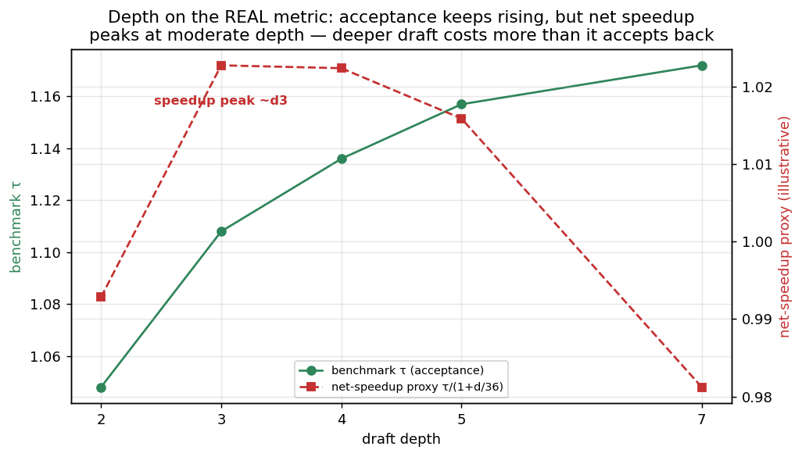
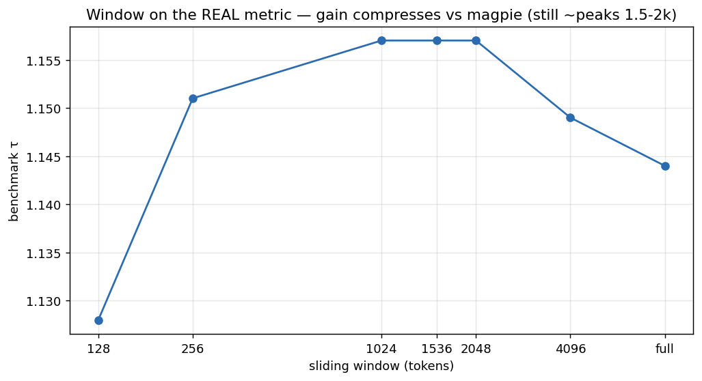

**Acceptance varies hugely by domain** — structured tasks accept **2–3× more** than open-ended (up to
~2.7×: math τ 1.93 vs summarization 0.72) — and Muon's advantage holds across all domains and all
block positions.

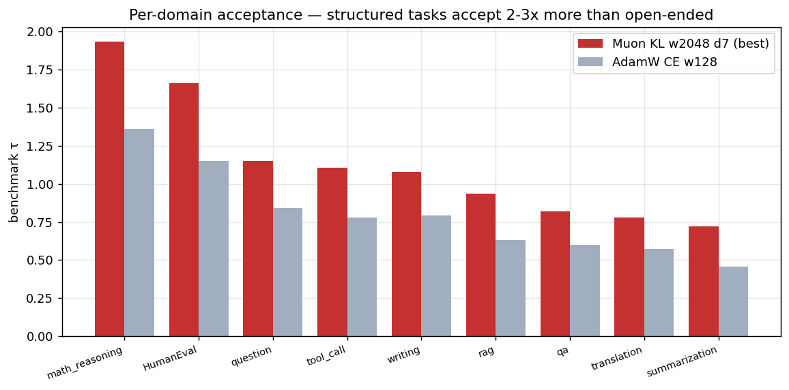
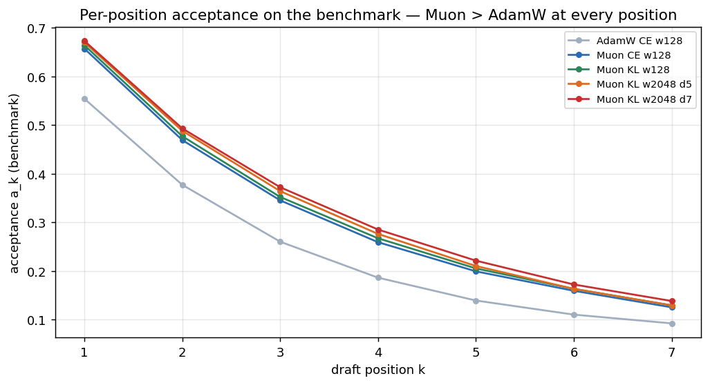

---

## 7. Final recipe & caveats

> **Common core:** **Muon (lr 0.01, momentum 0.95) + forward-KL + causal + FFN 6144**, 5 epochs on the
> 4997-sample data. Window/depth have two optima:
> - **Max-acceptance (EAL-optimal):** window 2048 + depth 7 → magpie-EAL 1.64, **benchmark τ 1.172**.
> - **Deployment-optimal (cost-aware):** window ~1024 + depth ~3–4 → **benchmark τ ≈ 1.11–1.14 at much
>   lower draft cost** (the net-speedup proxy peaks here; depth 7's extra acceptance doesn't pay for itself).
>
> Either way, **+33–41% real τ over the AdamW-CE-w128 baseline (τ ≈ 0.83)**.

### Three recommended configs + training commands (handoff)

All share the core: **Muon (lr 0.01, momentum 0.95) + forward-KL + causal + FFN-6144, 5 epochs, full
4997-sample data**, aux layers 1·9·17·25·34, draft-vocab 32000, max-anchors 3072. They differ only in
**depth × window**. Numbers are seed-42 (seed variance ~±0.002–0.006):

| # | config | depth | window | magpie EAL | bench τ | optimizes |
|---|--------|------:|------:|----:|----:|-----------|
| 1 | Max-acceptance | 7 | 2048 | 1.645 | 1.172 | highest raw acceptance length |
| 2 | **Balanced (recommended single pick)** | 5 | 1024 | 1.605 | 1.157 | best all-round; window saturates at 1024 (=2048 on τ) at lower cost |
| 3 | Speedup-optimal | 3 | 1024 | 1.557 | 1.108 | best *net* speedup (proxy peaks ~d3); lightest/fastest draft |

Run via the harness (single-GPU; Muon is single-GPU only). `source ablation/env.sh` first — it points
`--data-path`/`--hidden-states-path` at the 4997 dense cache; `run.sh` injects verifier, dflash type,
aux layers, draft-vocab, max-anchors, cosine schedule, seed 42. The injected `--lr 0.0006` is the AdamW
**aux-group** LR (norms); `--muon-lr` is the matrix group.

```bash
source ablation/env.sh
# 1) Max-acceptance — depth 7, window 2048
bash ablation/run.sh prod-maxacc 0 -- \
  --optimizer muon --muon-lr 0.01 --muon-momentum 0.95 --loss-type kl \
  --draft-block-causal --draft-intermediate-size 6144 --draft-sliding-window 2048 --num-layers 7 --epochs 5
# 2) Balanced (recommended) — depth 5, window 1024
bash ablation/run.sh prod-balanced 1 -- \
  --optimizer muon --muon-lr 0.01 --muon-momentum 0.95 --loss-type kl \
  --draft-block-causal --draft-intermediate-size 6144 --draft-sliding-window 1024 --num-layers 5 --epochs 5
# 3) Speedup-optimal — depth 3, window 1024
bash ablation/run.sh prod-fast 2 -- \
  --optimizer muon --muon-lr 0.01 --muon-momentum 0.95 --loss-type kl \
  --draft-block-causal --draft-intermediate-size 6144 --draft-sliding-window 1024 --num-layers 3 --epochs 5
```
Then score real acceptance with `ablation/eval_acceptance.py --ckpt <run>/checkpoint_best --bench
output_dir/Qwen3-8B_bench_dense`. For a shipped checkpoint, try **10–15 epochs** (old AdamW prod gained
a lot from 15ep) but watch the epoch-4→5 overfit dip seen under Muon; keep `checkpoint_best`. Layer-mix
(`--swa-layer-pattern`) is **not** needed — Phase M3 showed it's irrelevant at window 1024.

**Caveats / open threads:**
- **The depth-≈5 verdict rests on a cost-model estimate**, not a wall-clock measurement. The definitive
  answer is a real spec-decode loop — which needs **vLLM-side support for windowed/causal DFlash** (the
  stock path can't serve these checkpoints yet). That is the top remaining deliverable for deployment.
- **The benchmark is teacher-forced greedy τ** (the standard EAGLE-style proxy), not sampled-acceptance
  nor a real generation loop; faithful for greedy decoding.
- **841/924 prompts** survived HS extraction (the longest were dropped); rankings are unaffected.
- The two-stage fine-tune was abandoned due to a schedule-restart artifact; a gentler fine-tune (low
  constant LR) was not tested.

---

## 8. Appendix

- **Full leaderboards:** `ablation/RESULTS.md` (every phase, all numbers).
- **Plots:** `ablation/report/plots/` — phase-A bars (1–8) via `make_report_plots.py`; Muon training
  dynamics (9–14) via `make_training_curves.py`; benchmark acceptance (15–19) via `make_benchmark_plots.py`.
- **Acceptance harness:** `ablation/build_benchmark_cache.sh` (vLLM continuations → arrow → HS extract →
  densify) + `ablation/eval_acceptance.py` (per-domain per-position acceptance + τ, any checkpoint).
- **Optimizer:** `--optimizer muon --muon-lr` (single-GPU only; FSDP would break Newton-Schulz). See
  `src/speculators/train/trainer.py` (`_MuonAuxAdam`).
- **Logs:** `ablation/logs/*.log`; wandb `speculators-scripts-v2`.
- **Best checkpoints:** `output_dir/abl_ckpts/<run>/checkpoint_best`.
- **Phases:** A original ablation (AdamW) · B audit/bug-fixes · C dataset fix · D Muon (M0 LR · M1 loss ·
  M2a/b window · M2c depth) · E benchmark validation.
