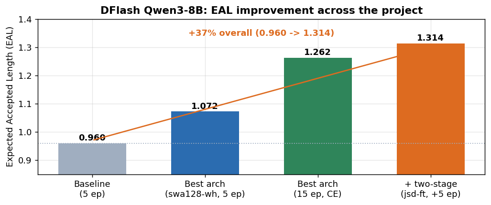
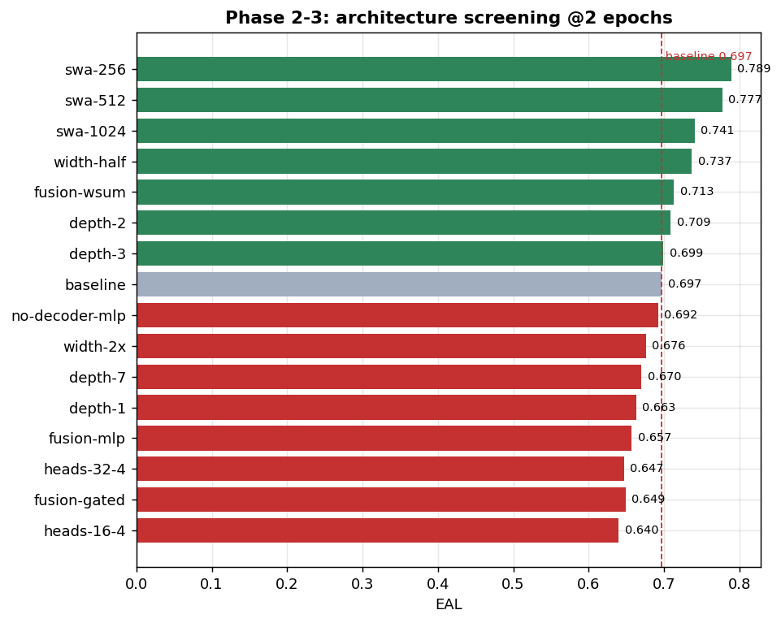
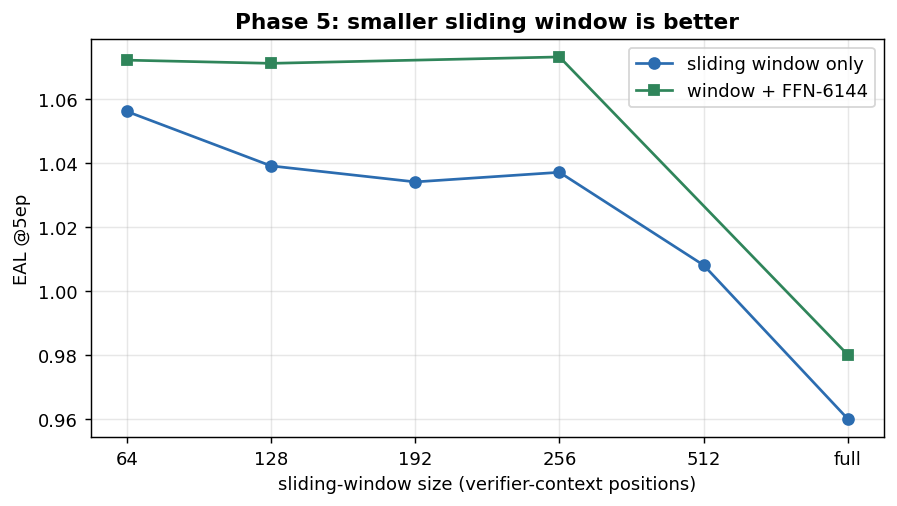
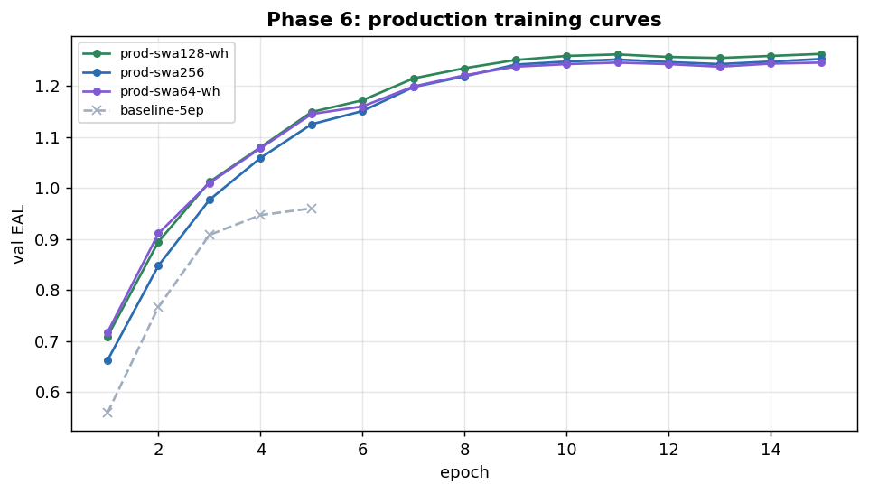
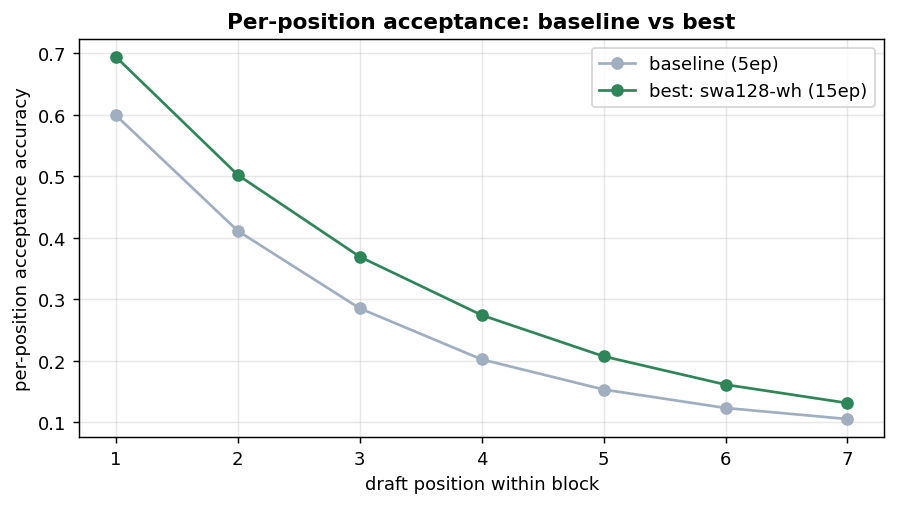
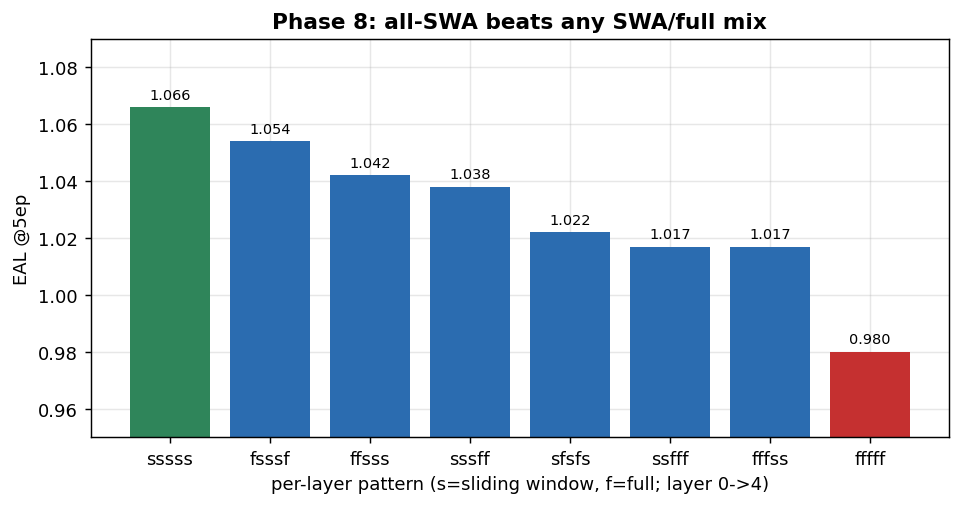
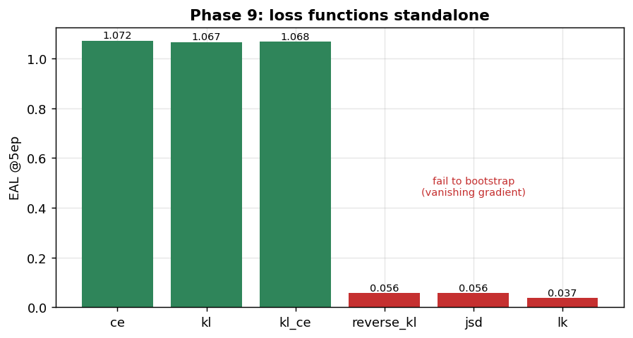
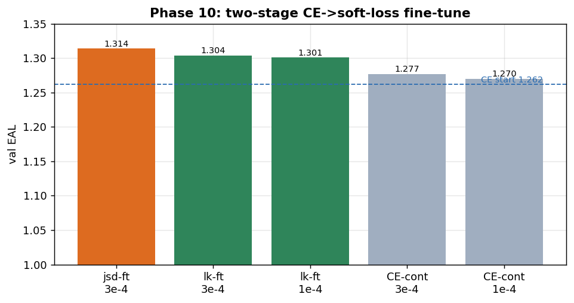

# DFlash Speculator Architecture & Training Ablation — Project Report

**Target:** DFlash draft model ("speculator") for **Qwen3-8B**
**Goal:** improve the drafter's token-acceptance (and val loss) over an essentially arbitrary baseline.
**Headline result:** **+37% Expected Accepted Length (EAL)** — from **0.960** (baseline, 5 epochs) to
**1.314** (final recipe), via a small **sliding-window attention** change + a **smaller FFN** + a
**two-stage CE→soft-loss fine-tune**.
**Environment:** single 8×H100 node; all runs logged to wandb project `speculators-scripts-v2`.



---

## 1. Background & motivation

The DFlash speculator is a small draft transformer that fuses auxiliary hidden states from several
verifier (Qwen3-8B) layers and predicts a block of future tokens, anchored on verifier context. The
shipped baseline was configured by convention, not evidence:

- 5 draft decoder layers, full self-attention, standard Qwen3 MLP, linear fusion of 5 aux layers
  (`1 9 17 25 34`, target = layer 36).
- Trained with cross-entropy against the verifier distribution.

We set out to find a better drafter by ablating **architecture** (depth, width, fusion, attention),
then **masking** (causal vs bidirectional, sliding-window mixes), and finally **loss functions**.

### Metric of record — EAL (Expected Accepted Length)
For per-position acceptance accuracies `a_1, a_2, …` within a draft block,
`EAL = Σ_k Π_{i≤k} a_i` — the expected number of draft tokens accepted under greedy verification
(a token is accepted only if all earlier ones were). Higher = more tokens per verifier step = bigger
speedup. EAL is computed from argmax matching, so it is **comparable across loss types** (val-loss is
not).

---

## 2. Infrastructure built

A cache-accelerated, 8-GPU experiment harness under `ablation/` made the sweeps cheap:

- **Hidden-state cache (`gen_cache.sh`).** Every run consumes the *same* verifier hidden states, so we
  generated them **once** with a vLLM extraction server (8-way data-parallel) and cached the 6 layers
  (`1 9 17 25 34 36`) to disk. Each training run then reads the cache instead of re-running the 8B
  verifier — turning each ablation into a cheap single-GPU job.
- **Dense dataset (`_densify_cache.py`).** The offline generator dropped ~28% of samples ("incomplete
  metadata"), leaving gaps over indices 0–4999. Training with `--on-missing skip` then crashed on
  empty packed batches (anchors landed on padding). Fix: filter to the 3,613 rows that *have* hidden
  states, re-index them contiguously with **symlinked** hs files (instant, no 658 GB copy), and use
  `--on-missing raise`.
- **Parallel queue (`queue.sh`, `run.sh`).** Fan a `queue.txt` across GPUs (1 run/GPU, launch-on-free).
  `run.sh` injects baseline defaults; each queue line is a one-knob override. Ranking via `eal.py`.
- **New training knobs added** (`scripts/train.py` + `src/speculators/models/dflash/*` +
  `models/metrics.py`): `--draft-intermediate-size`, `--draft-num-heads/-kv-heads`, `--no-decoder-mlp`,
  `--fusion-type {linear,mlp,gated,weighted_sum}`, `--draft-sliding-window`, `--draft-block-causal`,
  `--swa-layer-pattern`, `--loss-type {ce,kl,reverse_kl,kl_ce,lk,jsd}` (added `jsd`), and a fix so
  `--from-pretrained` respects `--loss-type` (enables loss-switched fine-tuning).

### Bugs found & fixed along the way
1. **vLLM connector × chunked prefill** — the hidden-states connector rejects chunked prefill; added
   `--no-enable-chunked-prefill` (caught by a dry run before the full 658 GB generation).
2. **torch 2.10 inductor crash** — the DFlash `@torch.compile` forward hit a joint-graph pattern-matcher
   bug at real shapes (`Not all inputs to pattern found … ['x','slice_shape']`); worked around with
   `torch._inductor.config.pattern_matcher = False`.
3. **Empty-batch crash** from the sparse cache (see dense dataset above).
4. **`queue.sh` GPU-list bug** — `read <<< "$(seq …)"` read only the first line, collapsing 8 jobs onto
   GPU 0 (serial). Fixed to word-split; the affected run was resumed from its checkpoint.
5. **`--from-pretrained` left `loss_type=None`** (PreTrainedModel default) → crash; now set from args.

---

## 3. Method

Two-tier protocol to keep the search cheap:
- **Screen @2 epochs** — broad one-knob-at-a-time sweeps, ranked relatively.
- **Promote @5, then 15 epochs** — confirm winners; EAL rises steeply with epochs.

A key lesson emerged early (see §4.1): **2-epoch screening reliably ranks *large* effects but mislabels
*marginal* ones** — two configs that looked good @2ep regressed @5ep. We treat small 2ep gaps as noise.

---

## 4. Results by phase

### 4.1 Architecture screening (@2 epochs)

15 one-knob variants vs the baseline (EAL 0.697 @2ep).



- **Sliding-window attention is the dominant lever** (`swa-256`: +13%). Smaller FFN, weighted-sum
  fusion, and shallower depth also help modestly.
- **Hurts:** deeper (7 layers), complex fusion (MLP/gated), fewer attention heads, wider FFN.
- *Caveat learned:* promoting the top configs to 5 epochs showed `fusion-wsum` and `depth-2` (marginal
  @2ep winners) actually **regressed** — only the large sliding-window and width-half effects held up.

### 4.2 Refinement — how big a window? (@5 epochs)

Since smaller windows kept winning, we pushed smaller and combined the *robust* winners (window +
smaller FFN), dropping the regressors.



- **Monotonic: smaller window is better** (64–128 best), and **window + FFN-6144** beats window alone.
- Best @5ep: `swa-64/128 + FFN-6144` ≈ **EAL 1.072** (+12% over the 5-epoch baseline 0.960), beating
  the earlier hand-stacked combo (1.045) — confirming wsum/depth-2 were dead weight.

### 4.3 Production training (@15 epochs)



- **More epochs lift EAL substantially** (the screening @2ep numbers are far below convergence).
- Winner: **`prod-swa128-wh`** (window 128 + FFN 6144, 5 layers) — **EAL 1.262 / val-loss 1.555**,
  **+31%** over the 15-epoch-equivalent baseline.

The gains appear at **every** draft position, not just the easy early ones:



### 4.4 Causal vs bidirectional intra-block masking (@5 epochs)

| config | bidirectional EAL | causal EAL |
|--------|------------------:|-----------:|
| swa128-wh | 1.071 | 1.072 |
| swa64-wh | 1.072 | 1.081 |
| swa256 | 1.037 | 1.039 |

**~Wash, tiny consistent edge to causal** (never worse) — adopted, since causal is also the
inference-correct choice for drafting.

### 4.5 Mixing sliding-window and full attention across layers (@5 epochs)

Does making some of the 5 layers full-attention (global context) while others stay local help?



**No — uniform all-SWA is best; every full-attention layer hurts** (monotonic: more `f` → lower EAL).
The local-context prior is beneficial at *every* layer.

### 4.6 Loss functions, standalone (@5 epochs)



- **CE = forward-KL = KL+CE (~1.07)** — no loss beats the CE default from scratch.
- **`reverse_kl`, `jsd`, `lk` fail to train from random init** (flat loss, ~random accuracy). Cause:
  vanishing per-logit gradient when the draft starts near-uniform over the 32k vocab against a peaked
  verifier target. An lr rescue (Phase 9b: jsd/lk higher lr, reverse_kl lower) confirmed it —
  `reverse_kl` only learns at lr 1e-4 (EAL 0.766, still < CE); `jsd`/`lk` stay flat at any lr.

Notably `lk` (`1 − Σ min(p_d,p_t)` = total-variation distance) is the *theoretically ideal* objective —
TVD is exactly the expected acceptance probability — but it cannot bootstrap on its own.

### 4.7 Two-stage: CE-pretrain → soft-loss fine-tune (@5 epochs from the 15-epoch CE checkpoint)

The fix for §4.6 is to give the soft losses a good starting point: pretrain with CE, then fine-tune.



- **It works.** `jsd` fine-tune (lr 3e-4) → **EAL 1.314**; `lk` fine-tune → 1.304 — both beat the
  **CE-continuation control** (1.277) and the starting checkpoint (1.262).
- Mechanism: the soft (full-distribution) targets **regularize** — these fine-tunes have *lower train*
  EAL but *higher val* EAL than continued CE, i.e. they generalize better than CE's hard-argmax target.
- `lk` needs moderate lr (1e-3 overshoots to 1.091).

---

## 5. Final recommended recipe

> **Architecture:** 5-layer draft + **sliding-window attention (window 128, all layers)** +
> **FFN intermediate 6144** + **causal intra-block masking** (linear fusion, decoder MLP retained,
> 32/8 heads — all baseline).
>
> **Training:** **CE to convergence, then fine-tune ~5 epochs with `jsd` (or `lk`) at lr 3e-4.**
>
> **Result: EAL 1.314** — **+37%** over the 5-epoch baseline (0.960); **+4%** over the pure-CE best
> (1.262).

```bash
# stage 1 (CE):
--num-layers 5 --draft-sliding-window 128 --draft-intermediate-size 6144 --draft-block-causal \
  --loss-type ce
# stage 2 (fine-tune from the stage-1 checkpoint):
--from-pretrained <ckpt> --loss-type jsd --lr 3e-4 --epochs 5  # (+ same arch flags)
```

---

## 6. Caveats & limitations

- **vLLM deployability.** Windowed/causal DFlash is a *novel* architecture. The checkpoints are valid
  `speculators` models, but serving them needs corresponding vLLM-side support for the windowed DFlash
  attention; the stock EAGLE-3/DFlash path won't run them as-is.
- **Data.** Everything trained on the **dense 3,613-sample cache** (28% of the 5k was dropped by the
  generator). A full-data regeneration would raise absolute numbers (not the relative rankings).
- **Greedy vs sampling acceptance.** EAL here uses greedy/argmax matching, which CE optimizes directly.
  The `lk`/TVD objective targets *sampling*-based acceptance (probability-mass overlap); it may help
  more under sampled decoding, which we did not measure.
- **`prod-combo`** resumed from an epoch-6 checkpoint (after the `queue.sh` bug), so it is excluded from
  the per-epoch training-curve plot to keep the epoch axis honest.

---

## 7. Suggested next steps

1. **Final deployable checkpoint:** run the full recipe (CE→jsd two-stage) longer, ideally on
   regenerated full data.
2. **Measure sampling-based acceptance** (where `lk`/TVD should shine beyond the greedy-EAL metric).
3. **vLLM support** for windowed/causal DFlash attention to actually serve the winner.

---

## 8. Appendix

- **Full numeric leaderboards:** `ablation/RESULTS.md`.
- **Plots:** `ablation/report/plots/` (regenerate with `.venv/bin/python ablation/report/make_report_plots.py`).
- **All run logs:** `ablation/logs/*.log`; wandb project `speculators-scripts-v2` (runs `abl-<name>`).
- **Best checkpoints:** `output_dir/abl_ckpts/<run>/checkpoint_best` (per-epoch checkpoints were pruned
  to reclaim disk; `checkpoint_best` retained per run).
- **Phases covered:** 1 cache · 2–3 screening · 4 promote · 5 refine window · 6 production · 7 causal ·
  8 layer-mix · 9/9b loss functions · 10 two-stage fine-tune.
